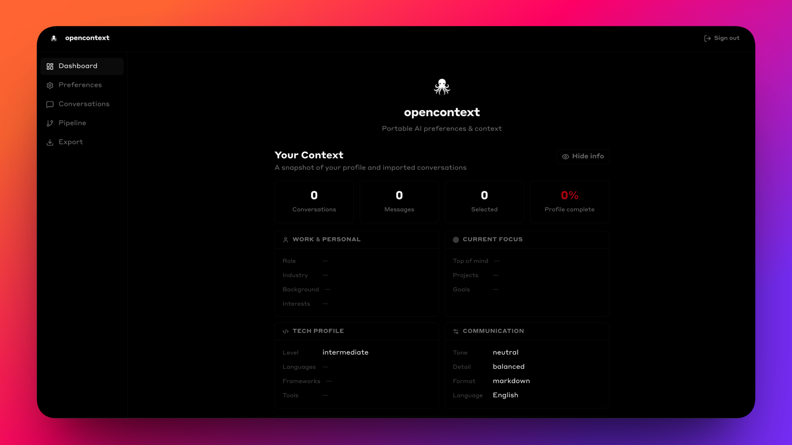
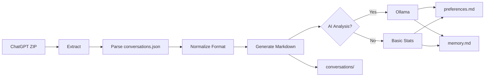

<div align="center">

> **🔌 MCP Server available** — Give Claude persistent memory across every conversation. Install the opencontext MCP server and Claude can save, recall, and search your context automatically. [Jump to setup →](#-mcp-server)


# opencontext

### Migrate your ChatGPT conversations to Claude with AI-powered analysis

[](https://opensource.org/licenses/MIT)
[](https://nodejs.org/)
[](https://www.typescriptlang.org/)
[](http://makeapullrequest.com)
[](https://www.docker.com/)


[Features](#-features) • [Quick Start](#-quick-start) • [Usage](#-usage) • [Documentation](#-documentation) • [Contributing](#-contributing)

<br/>



</div>

---

## 📖 Overview

**opencontext** is a CLI tool that converts ChatGPT conversation exports into Claude-compatible formats. It uses local AI (Ollama) to analyze your chat history and generate:

- **🎯 Preferences** - Your communication style for Claude's settings
- **🧠 Memory** - Factual information for Claude's memory system
- **💬 Conversations** - All chats as readable markdown files

### Why Use This?

When migrating from ChatGPT to Claude, you lose all context about your communication preferences, background, and conversation history. This tool solves that by:

1. Extracting your full ChatGPT history
2. Analyzing your communication patterns with AI
3. Generating Claude-ready files you can paste directly into settings
4. Converting all conversations to portable markdown

**Result**: Claude knows who you are, how you communicate, and has access to your full chat history.

---

## ✨ Features

<table>
<tr>
<td width="50%">

### 🤖 AI-Powered Analysis
- Generates communication preferences
- Extracts work context and expertise
- Identifies current topics and focus
- Supports multiple LLM models

</td>
<td width="50%">

### 🔒 Privacy First
- 100% local processing
- No external API calls
- Your data never leaves your machine
- Dashboard privacy toggle blurs PII

</td>
</tr>
<tr>
<td width="50%">

### 📦 Complete Migration
- Parses complex conversation trees
- Handles images and attachments
- Preserves all metadata
- Export to Claude, ChatGPT, or Gemini

</td>
<td width="50%">

### 🔌 MCP Server
- Persistent context across Claude chats
- Save, recall, search, and tag memories
- Works with Claude Code & Claude Desktop
- Local JSON store at `~/.opencontext/`

</td>
</tr>
</table>

---

## 🚀 Quick Start

### Prerequisites

- **Node.js 20+** - [Download](https://nodejs.org/)
- **ChatGPT Export** - [How to export](#-getting-your-chatgpt-export)
- **Ollama** (optional) - [Install](https://ollama.ai/) for AI analysis

### Installation

```bash
# Clone the repository
git clone https://github.com/adityak74/opencontext.git
cd opencontext

# Install CLI/MCP dependencies
npm install

# Build the project
npm run build
```

### Option A: Web UI (Recommended)

```bash
cd ui
npm install
npm run dev    # Opens at http://localhost:5173
```

The UI lets you:
- Fill in your preferences interactively
- Import ChatGPT conversations
- Preview and export to Claude, ChatGPT, or Gemini formats
- View your context dashboard with privacy toggle (hides PII when screensharing)

### Option B: CLI

```bash
# Convert your ChatGPT export
npm start -- convert path/to/chatgpt-export.zip

# Output will be in ./claude-export/
```

That's it! 🎉 You now have files ready to paste into Claude.

### Option C: Docker

**Web UI**
```bash
docker build -f Dockerfile.ui -t opencontext-ui .
docker run -p 5173:5173 opencontext-ui
# Opens at http://localhost:5173
```

**MCP Server**
```bash
docker build -t opencontext-mcp .
docker run -i -v opencontext-data:/root/.opencontext opencontext-mcp
```

---

## 📂 What Gets Generated

```
claude-export/
├── 📋 preferences.md       # Paste into Claude Settings → Preferences
├── 🧠 memory.md            # Paste into Claude → Manage Memory
├── 👤 user-profile.md      # Your ChatGPT account info
├── 📑 index.md             # Searchable conversation list
└── 💬 conversations/       # Individual markdown files
    ├── 001-first-chat.md
    ├── 002-another-topic.md
    └── ...
```

### preferences.md - Communication Style

**What it contains:**
- How you prefer explanations (detailed, concise, step-by-step)
- Technical depth preferences
- Tone preferences (casual/formal)
- Code formatting preferences

**Example:**
```
I prefer clear and direct explanations that get straight to the point,
especially when the topic is technical. I'd like step-by-step instructions
and concrete code snippets. I'm comfortable with technical language and
enjoy seeing code formatted in Markdown blocks...
```

**Usage:** Copy → Paste into Claude Settings → Preferences field

### memory.md - About You

**What it contains:**
- **Work context** - Your job, technologies, projects
- **Personal context** - Education, expertise, skills
- **Top of mind** - Current focus, recent topics

**Example:**
```
Work context:
User is a senior software engineer working with cloud infrastructure,
Docker, Kubernetes, and VPN solutions. Currently developing AI/ML
deployment systems...

Personal context:
Demonstrates expertise in networking, containerization, Python,
TypeScript, and CI/CD automation...

Top of mind:
Finalizing VPN architecture decisions and exploring AI service
deployment strategies...
```

**Usage:** Copy → Paste into Claude → Manage Memory

---

## 💻 Usage

### CLI Commands

```bash
npm start -- convert <zip-file> [options]
```

### Options

| Option | Description | Default |
|--------|-------------|---------|
| `-o, --output <dir>` | Output directory | `./claude-export` |
| `--model <name>` | Ollama model to use | `gpt-oss:20b` |
| `--ollama-host <url>` | Ollama server URL | `http://localhost:11434` |
| `--skip-preferences` | Skip AI analysis (faster) | `false` |
| `--verbose` | Detailed logging | `false` |
| `-h, --help` | Show help | - |

### Examples

#### Remote Ollama Server
```bash
npm start -- convert export.zip --ollama-host http://192.168.1.100:11434
```

#### Different AI Model
```bash
npm start -- convert export.zip --model qwen2.5:32b
```

#### Fast Mode (No AI)
```bash
npm start -- convert export.zip --skip-preferences
```

#### Custom Output Directory
```bash
npm start -- convert export.zip -o ~/Documents/claude-import
```

#### All Options Combined
```bash
npm start -- convert export.zip \
  -o ~/output \
  --ollama-host http://gpu-server:11434 \
  --model llama3:70b \
  --verbose
```

---

## 📚 Documentation

### Getting Your ChatGPT Export

1. Go to [ChatGPT Settings](https://chat.openai.com/)
2. Click profile → **Settings** → **Data Controls**
3. Click **Export data**
4. Wait for email (usually 1-4 hours)
5. Download the zip file
6. Use with opencontext

### Migrating to Claude

#### Step 1: Set Preferences

1. Open `preferences.md`
2. Copy all text
3. Go to [Claude Settings](https://claude.ai/settings) → Preferences
4. Paste into "What personal preferences should Claude consider?"
5. Save changes

#### Step 2: Add Memory

1. Open `memory.md`
2. Copy all text
3. Click profile → **Manage Memory**
4. Paste content
5. Verify and save

#### Step 3: Use Conversations (Optional)

Browse `conversations/` folder and copy relevant chats into Claude for context.

**Alternative:** Create a Claude project and upload files as project knowledge.

### Supported Ollama Models

| Model | Size | Speed | Quality | Recommended For |
|-------|------|-------|---------|-----------------|
| `gpt-oss:20b` | 13GB | Medium | High | Best overall results |
| `qwen2.5:32b` | 20GB | Medium | High | Technical content |
| `llama3:70b` | 40GB | Slow | Highest | Maximum accuracy |
| `llama3:8b` | 5GB | Fast | Good | Quick conversions |

### How It Works



**Two AI calls:**
1. **Preferences** - Analyzes communication patterns (HOW you talk)
2. **Memory** - Extracts facts about you (WHO you are)

---

## 🛠️ Development

### Setup Development Environment

```bash
# Clone the repo
git clone https://github.com/adityak74/opencontext.git
cd opencontext

# Install dependencies
npm install

# Run in dev mode (with hot reload)
npm run dev convert export.zip

# Build TypeScript
npm run build

# Run tests
npm test

# Run tests with coverage
npm run test:coverage
```

### Project Structure

```
opencontext/
├── src/                        # CLI + MCP server
│   ├── index.ts                # CLI entry point (Commander.js)
│   ├── extractor.ts            # ZIP extraction & temp management
│   ├── parsers/
│   │   ├── types.ts            # TypeScript interfaces
│   │   ├── chatgpt.ts          # Parse ChatGPT format
│   │   └── normalizer.ts       # Normalize to common schema
│   ├── formatters/
│   │   └── markdown.ts         # Markdown generation
│   ├── analyzers/
│   │   └── ollama-preferences.ts  # AI-powered analysis (Ollama)
│   ├── utils/
│   │   └── file.ts             # File I/O utilities
│   └── mcp/                    # MCP server
│       ├── index.ts            # Entry point (stdio transport)
│       ├── server.ts           # Tool definitions
│       ├── store.ts            # JSON-based context store
│       └── types.ts            # Type definitions
│
└── ui/                         # Web dashboard (React + Vite)
    └── src/
        ├── components/
        │   ├── Dashboard.tsx       # Context overview + privacy toggle
        │   ├── PreferencesEditor.tsx
        │   ├── ContextViewer.tsx
        │   ├── ConversionPipeline.tsx
        │   └── VendorExport.tsx
        ├── store/context.tsx       # React Context state
        ├── types/preferences.ts   # Shared types
        └── exporters/             # Claude, ChatGPT, Gemini exporters
```

### Tech Stack

**CLI / MCP Server**
- **TypeScript 5.9** - Type-safe development
- **Commander.js** - CLI framework
- **@modelcontextprotocol/sdk** - MCP server
- **Ollama** - Local LLM inference (optional)
- **adm-zip** - ZIP file handling
- **chalk** - Terminal colors

**Web UI**
- **React 19 + Vite 7** - UI framework and build tool
- **React Router 7** - Client-side routing
- **Tailwind CSS v4** - Utility-first styling
- **shadcn/ui** - Component library (new-york style)
- **Lucide React** - Icons

---

## 🔌 MCP Server

The **opencontext MCP server** lets Claude remember things across conversations using a persistent local store.

### Available Tools

| Tool | Trigger phrase |
|------|---------------|
| `save_context` | "remember this", "save this", "keep this in mind" |
| `recall_context` | "what did I say about...", "do you remember..." |
| `list_contexts` | "show my saved contexts" |
| `search_contexts` | Multi-keyword AND search |
| `update_context` | Update a context by ID |
| `delete_context` | Delete a context by ID |

Context is stored at `~/.opencontext/contexts.json`. Set `OPENCONTEXT_STORE_PATH` to use a custom location.

### Connect to Claude Code

```bash
# Build first
npm run build
```

Add to `~/.claude/settings.json`:
```json
{
  "mcpServers": {
    "opencontext": {
      "command": "node",
      "args": ["/path/to/opencontext/dist/mcp/index.js"]
    }
  }
}
```

### Dev Mode (no build required)

```json
{
  "mcpServers": {
    "opencontext": {
      "command": "npx",
      "args": ["tsx", "/path/to/opencontext/src/mcp/index.ts"]
    }
  }
}
```

The Dashboard page in the web UI shows this setup guide with copy buttons.

---

## 🐳 Docker

Both the Web UI and MCP Server ship with Dockerfiles for containerized deployment.

### Web UI

Build and run the UI with a lightweight static server on port 5173:

```bash
# Build
docker build -f Dockerfile.ui -t opencontext-ui .

# Run
docker run -p 5173:5173 opencontext-ui
```

Open [http://localhost:5173](http://localhost:5173) in your browser.

### MCP Server

The MCP server uses stdio transport and stores context in a named volume so data persists across container restarts.

```bash
# Build
docker build -t opencontext-mcp .

# Run (the -i flag is required for stdin/stdout communication)
docker run -i -v opencontext-data:/root/.opencontext opencontext-mcp
```

To use a custom store path, pass the environment variable:

```bash
docker run -i \
  -v opencontext-data:/data \
  -e OPENCONTEXT_STORE_PATH=/data/contexts.json \
  opencontext-mcp
```

#### Connect to Claude Code via Docker

Add this to `~/.claude/settings.json`:

```json
{
  "mcpServers": {
    "opencontext": {
      "command": "docker",
      "args": [
        "run", "--rm", "-i",
        "-v", "opencontext-data:/root/.opencontext",
        "opencontext-mcp"
      ]
    }
  }
}
```

---

## 🐛 Troubleshooting

<details>
<summary><b>Ollama Issues</b></summary>

**"Ollama is not running"**
```bash
ollama serve
```

**"Model not found"**
```bash
ollama list
ollama pull gpt-oss:20b
```

**Connection refused**
```bash
# Check Ollama
curl http://localhost:11434/api/tags

# Or use remote server
npm start -- convert export.zip --ollama-host http://your-server:11434
```

</details>

<details>
<summary><b>Export Issues</b></summary>

**"conversations.json not found"**
- Verify zip file is correct ChatGPT export
- Re-download if corrupted

**"No valid conversations"**
- Check you have conversations in ChatGPT
- Try exporting again

</details>

<details>
<summary><b>Performance Issues</b></summary>

**Analysis is slow**
- Use `--skip-preferences` for instant conversion
- Try faster model: `--model llama3:8b`
- Use remote GPU: `--ollama-host http://gpu-server:11434`

**Out of memory**
- Normal for 100+ conversations
- Tool handles gracefully with truncation

</details>

---

## 🤝 Contributing

We welcome contributions! Here's how to get involved:

### Ways to Contribute

- 🐛 **Report bugs** - Open an [issue](https://github.com/adityak74/opencontext/issues)
- 💡 **Suggest features** - Start a [discussion](https://github.com/adityak74/opencontext/discussions)
- 📖 **Improve docs** - Fix typos, add examples
- 🔧 **Submit code** - Fix bugs, add features

### Development Workflow

1. **Fork** the repository
2. **Clone** your fork: `git clone https://github.com/adityak74/opencontext.git`
3. **Create** a branch: `git checkout -b feature/amazing-feature`
4. **Make** changes and test thoroughly
5. **Commit** with clear message: `git commit -m 'Add amazing feature'`
6. **Push** to your fork: `git push origin feature/amazing-feature`
7. **Open** a Pull Request

### Guidelines

- Follow existing code style and conventions
- Add comments for complex logic
- Test with real ChatGPT exports
- Update documentation for new features
- Keep PRs focused (one feature/fix per PR)

### Code of Conduct

Be respectful, inclusive, and collaborative. See [CODE_OF_CONDUCT.md](CODE_OF_CONDUCT.md) for details.

---

## 📊 Performance

Typical conversion times:

| Export Size | Conversations | With AI Analysis | Without AI |
|-------------|---------------|------------------|------------|
| Small | 1-20 | ~1 minute | ~5 seconds |
| Medium | 20-100 | ~5 minutes | ~10 seconds |
| Large | 100+ | ~15 minutes | ~30 seconds |

**Factors affecting speed:**
- Model size (gpt-oss:20b slower than llama3:8b)
- Hardware (GPU vs CPU)
- Ollama location (local vs remote)
- Number of conversations

---

## 🔒 Privacy & Security

### Local Processing

✅ **All data stays on your machine**
- No external API calls (except your Ollama server)
- No telemetry or analytics
- No data collection
- Safe for sensitive conversations

### What Gets Sent to Ollama

Only when AI analysis is enabled:
- Conversation text → Ollama (your infrastructure)
- You control the data and infrastructure

**Want pure local processing?**
```bash
npm start -- convert export.zip --skip-preferences
```

---

## ⚠️ Limitations

- **ChatGPT only** - Currently supports only ChatGPT exports (Gemini planned)
- **Manual Claude import** - No direct API (paste manually)
- **Image references** - Images copied but not embedded
- **Token limits** - Very large exports may be truncated

---

## 🗺️ Roadmap

### Planned Features

- [ ] Google Gemini export support
- [ ] Perplexity export support
- [ ] Claude Projects API integration (when available)
- [ ] Conversation search and filtering
- [ ] Better image handling (Base64 embedding)
- [ ] Multi-language support
- [x] Web UI dashboard with privacy toggle
- [x] MCP server for persistent context
- [x] Export to Claude, ChatGPT, and Gemini formats
- [x] Automated tests
- [x] Docker support (Web UI + MCP server)

### Future Possibilities

- Direct Claude API integration
- Conversation merging/combining
- Custom prompt templates
- Browser extension

**Vote on features:** [Discussions](https://github.com/adityak74/opencontext/discussions)

---

## ❓ FAQ

<details>
<summary><b>Is this officially supported by Anthropic or OpenAI?</b></summary>
No, this is a community-built tool. Not affiliated with either company.
</details>

<details>
<summary><b>Do I need Ollama?</b></summary>
No, but AI analysis produces much better preferences and memory. Use <code>--skip-preferences</code> to skip it.
</details>

<details>
<summary><b>Can I use Claude API instead of Ollama?</b></summary>
Not yet. Ollama is free and runs locally. We may add Claude API support later.
</details>

<details>
<summary><b>Will this work with 1000+ conversations?</b></summary>
Yes! Markdown conversion works regardless of size. AI analysis may truncate input but still produces useful results.
</details>

<details>
<summary><b>Can I edit the generated files?</b></summary>
Absolutely! They're just text files. Edit before pasting into Claude.
</details>

<details>
<summary><b>Does this modify my ChatGPT account?</b></summary>
No, it only reads the export. Your ChatGPT data is unchanged.
</details>

<details>
<summary><b>Can I run this multiple times?</b></summary>
Yes, it will overwrite previous output. Use different <code>-o</code> directories to keep versions.
</details>

<details>
<summary><b>Is my data safe?</b></summary>
Yes! Everything runs locally. No external APIs except your own Ollama server.
</details>

---

## 📜 License

This project is licensed under the **MIT License** - see the [LICENSE](LICENSE) file for details.

```
MIT License

Copyright (c) 2026 opencontext contributors

Permission is hereby granted, free of charge, to any person obtaining a copy
of this software and associated documentation files (the "Software"), to deal
in the Software without restriction, including without limitation the rights
to use, copy, modify, merge, publish, distribute, sublicense, and/or sell
copies of the Software...
```

---

## 🙏 Acknowledgments

- **Anthropic** - For building Claude, the AI that inspired this tool
- **OpenAI** - For ChatGPT and conversation export functionality
- **Ollama** - For making local LLM inference accessible
- **Contributors** - Everyone who has contributed code, ideas, and feedback
- **Community** - Users who test and provide valuable feedback

### Built With

- [Node.js](https://nodejs.org/) - JavaScript runtime
- [TypeScript](https://www.typescriptlang.org/) - Type-safe development
- [Commander.js](https://github.com/tj/commander.js) - CLI framework
- [Ollama](https://ollama.ai/) - Local LLM inference
- [adm-zip](https://github.com/cthackers/adm-zip) - ZIP file handling
- [chalk](https://github.com/chalk/chalk) - Terminal styling

---

## 💬 Support & Community

- 🐛 **Bug Reports**: [GitHub Issues](https://github.com/adityak74/opencontext/issues)
- 💡 **Feature Requests**: [GitHub Discussions](https://github.com/adityak74/opencontext/discussions)
- ❓ **Questions**: Open an issue with `question` label
- 📧 **Contact**: Open an issue for direct contact

### Useful Links

- [ChatGPT Export Guide](https://help.openai.com/en/articles/7260999-how-do-i-export-my-chatgpt-history-and-data)
- [Claude Documentation](https://claude.ai/)
- [Ollama Documentation](https://ollama.ai/)
- [Ollama Model Library](https://ollama.ai/library)

---

<div align="center">

### ⭐ Star us on GitHub — it motivates us to keep improving!

**Made with ❤️ by the AI community**

*Seamlessly migrate from ChatGPT to Claude with all your context intact*

[Report Bug](https://github.com/adityak74/opencontext/issues) • [Request Feature](https://github.com/adityak74/opencontext/discussions) • [View Roadmap](https://github.com/adityak74/opencontext/projects)

</div>
